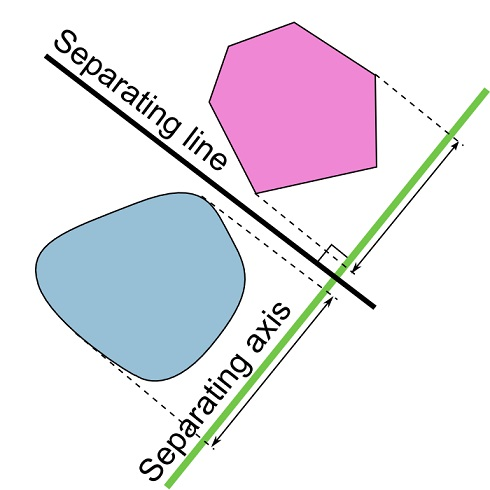

# SPEJ-Physics2D
A simple Physics2D Engine skeleton for java.
## Basic Shape
- Circle
- Polygon
  - triangle and rectangle
  - others: clock-wise
## Collision Detection
1. SAT - Separating Axis Theorem
  1. Circle vs. Circle
  2. Circle vs. Polygon
  3. Polygon vs. Polygon  

## Impulse Resolution
- ResolveCollision
- PositionalCorrection
## Interface
- Trigger and Render
## To begin
```JAVA
//Step1. PhysicsEngineController
PhysicsEngineController pc=PhysicsEngineController.getPhysicsEngineController();

//Step2. Set Render
GameRender gr=new GameRender();
pc.setRender(gr);

//Step3. Initial constant
pc.initialGravity(10);
pc.initialResistance(0.1,0.1);

//Step4. Set Object
pc.initialXXX(...);

//Step5. Finalize
pc.readyPhysicsRunning();
pc.startPhysicsRunning();
```
